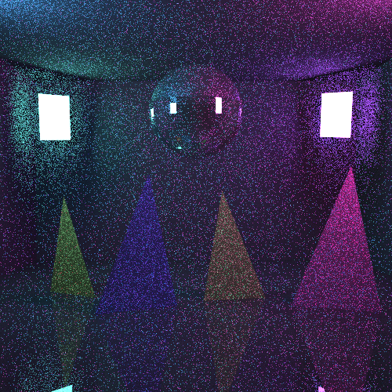
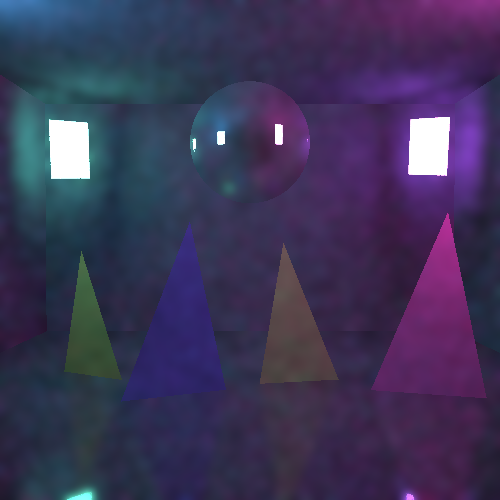
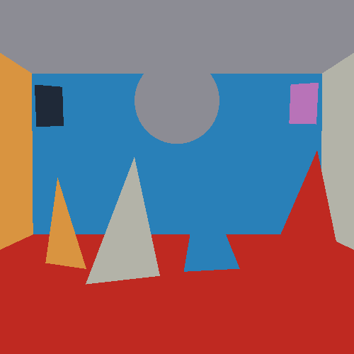
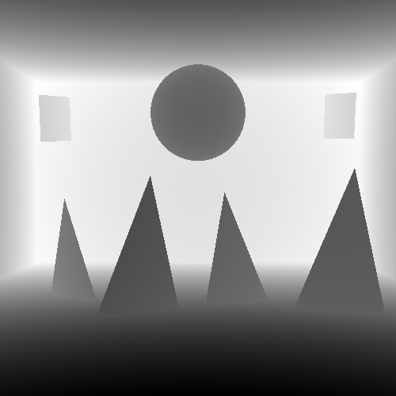
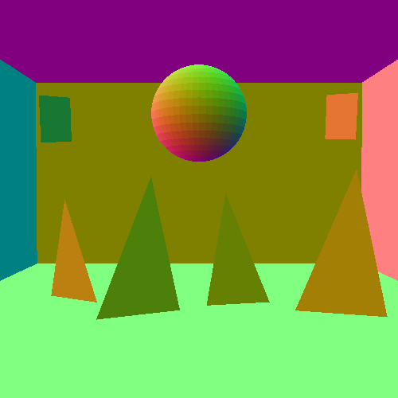

# Лабораторная работа 5

## Тема

Билатеральная фильтрация синтезированного изображения с сохранением границ объектов.

## Цель работы

Реализовать метод билатеральной фильтрации изображения, полученного методом
трассировки путей, и показать, что фильтрация уменьшает шум, но при этом
сохраняет границы объектов и не нарушает суммарную яркость отдельных объектов
сцены.

## Задание

Необходимо реализовать метод билатеральной фильтрации синтезированного
изображения с сохранением границ объектов. Корректность результата нужно
показать визуально и численно.

В качестве исходного изображения используется результат лабораторной работы 4:
сцена строится методом path tracing. Для фильтрации дополнительно формируются
буферы первого пересечения:

- прямая яркость;
- вторичная яркость;
- глубина;
- нормаль поверхности;
- индекс объекта.

В практическом задании предлагалось использовать арифметическое среднее или
медианный фильтр. В данной работе используется арифметическое взвешенное
среднее, то есть значения соседних пикселей усредняются с весами. Медианный
фильтр не используется.

## Краткое описание работы

Лабораторная работа 5 сделана как надстройка над лабораторной работой 4. Сначала
программа строит шумное изображение методом path tracing. Затем из того же
рендера сохраняются дополнительные данные о видимой поверхности в каждом
пикселе: глубина, нормаль и номер объекта.

После этого программа отдельно фильтрует две составляющие яркости:

- `direct` - прямое освещение от источников света;
- `secondary` - вторичное освещение, полученное после отражений луча.

После фильтрации эти две составляющие складываются обратно. В конце выполняется
нормировка по объектам, чтобы суммарная яркость каждого объекта после
фильтрации совпадала с суммарной яркостью до фильтрации.

## Теоретическая часть

### Шум в path tracing

В лабораторной работе 4 изображение строится методом Монте-Карло. Для каждого
пикселя выпускается несколько случайных лучей, а затем их результаты
усредняются. При малом числе лучей на пиксель изображение получается шумным,
потому что случайная оценка освещенности имеет большую дисперсию.

Увеличение числа лучей на пиксель уменьшает шум, но время расчета растет почти
пропорционально. Поэтому после рендера можно применить фильтрацию, которая
сглаживает шум, но старается не портить границы объектов.

### Билатеральная фильтрация

Обычное усреднение заменяет значение пикселя средним значением соседей в окне.
Такой подход уменьшает шум, но размывает границы. Билатеральная фильтрация
работает аккуратнее: соседний пиксель влияет на текущий только в том случае,
если он достаточно похож на него.

Общая формула фильтрации:

```text
g(p) = 1 / Wp * sum(f(q) * weight(p, q))
```

где:

- `p` - текущий пиксель;
- `q` - соседний пиксель в окне фильтрации;
- `f(q)` - исходное значение соседнего пикселя;
- `g(p)` - новое значение текущего пикселя;
- `weight(p, q)` - итоговый вес соседнего пикселя;
- `Wp` - сумма всех весов для нормировки.

Нормировка должна учитывать все веса:

```text
Wp = sum(weight(p, q))
```

В данной работе вес является произведением нескольких факторов:

```text
weight = G_space * G_color * G_depth * G_normal * object_mask
```

Компоненты веса:

- `G_space` - вес по расстоянию между пикселями в изображении;
- `G_color` - вес по различию яркости или цвета;
- `G_depth` - вес по различию глубины;
- `G_normal` - вес по различию нормалей;
- `object_mask` - проверка, что пиксели принадлежат одному объекту.

Если соседний пиксель принадлежит другому объекту, его вклад не используется.
Это позволяет сглаживать шум внутри объекта, но не переносить цвет и яркость
через границы объектов.

### Гауссова функция

Для вычисления весов используется гауссова функция:

```text
G(x, sigma) = exp(-(x * x) / (2 * sigma * sigma))
```

Она плавно уменьшает вес при увеличении отличия между пикселями. Если отличие
маленькое, вес близок к `1`. Если отличие большое, вес становится близким к `0`.

Параметр `sigma` задает чувствительность:

- большое `sigma` делает фильтр мягче и разрешает смешивать более разные
  значения;
- маленькое `sigma` делает фильтр строже и сильнее сохраняет детали и границы.

В программе используются параметры:

- `sigma_spatial` - чувствительность к расстоянию по изображению;
- `sigma_color` - чувствительность к отличию цвета;
- `sigma_depth` - чувствительность к отличию глубины;
- `sigma_normal` - чувствительность к отличию нормали.

### Глубина, нормаль и индекс объекта

Хотя итоговое изображение является двумерным, оно получено из трехмерной сцены.
Поэтому для каждого пикселя можно сохранить дополнительные данные о первом
пересечении луча со сценой.

Глубина - это расстояние от камеры до первой видимой точки поверхности. Она
помогает не смешивать пиксели, которые находятся далеко друг от друга в 3D, но
случайно оказались рядом на изображении.

Нормаль - это направление, перпендикулярное поверхности в точке пересечения.
Она помогает не смешивать соседние поверхности с разной ориентацией, например
пол и стену или две грани объекта.

Индекс объекта нужен для жесткого сохранения границ. Если два пикселя относятся
к разным объектам, они не участвуют в усреднении друг друга.

### Прямая и вторичная яркость

В path tracing итоговая яркость пикселя складывается из нескольких вкладов. В
работе она разделяется на две части.

Прямая яркость - это вклад света, который оценивается на первой видимой
поверхности. То есть луч из камеры попадает в поверхность, и для этой точки
считается освещение от источников света.

Вторичная яркость - это вклад, который появляется после продолжения пути:
диффузных и зеркальных отражений. Он описывает непрямое освещение, переотражения
и цветовые переносы света между поверхностями.

Эти компоненты фильтруются отдельно, потому что у них может быть разная
структура шума. После фильтрации они складываются:

```text
filtered = filtered_direct + filtered_secondary
```

### Сохранение суммарной яркости

После фильтрации выполняется дополнительная нормировка по каждому объекту.
Требование записывается так:

```text
sum(g(p)) = sum(f(p)), p принадлежит O
```

Это означает, что фильтр может перераспределять яркость внутри объекта, но не
должен суммарно создавать или удалять яркость объекта.

## Реализация программы

Основные файлы программы:

- [lab4_5.py](/Users/devianted/Desktop/Учёба/МТ:АКГ/MOI/lab4-5/lab4_5.py) - рендер, формирование буферов, фильтрация, GUI и CLI;
- [scenes.py](/Users/devianted/Desktop/Учёба/МТ:АКГ/MOI/lab4-5/scenes.py) - описание сцен и геометрии;
- [README.md](/Users/devianted/Desktop/Учёба/МТ:АКГ/MOI/lab4-5/README.md) - краткая инструкция по запуску.

Программа выполняет следующие шаги:

1. Строит трехмерную сцену из треугольников.
2. Выполняет path tracing и получает шумное изображение.
3. Для каждого пикселя сохраняет `direct`, `secondary`, `depth`, `normal`,
   `object_id`.
4. Фильтрует прямую яркость билатеральным фильтром.
5. Фильтрует вторичную яркость тем же способом.
6. Складывает отфильтрованные компоненты.
7. Нормирует суммарную яркость по каждому объекту.
8. Сохраняет изображения и файл с численной проверкой.

Основные функции:

| Функция | Назначение |
|---|---|
| `render_buffers` | рендер изображения и формирование буферов ЛР 5 |
| `trace_ray_components` | разделение вклада луча на прямую и вторичную яркость |
| `first_hit_buffers` | получение глубины, нормали и номера объекта |
| `bilateral_filter_buffers` | фильтрация прямой и вторичной яркости |
| `filter_component` | билатеральная фильтрация одного буфера яркости |
| `preserve_luminance_by_object` | сохранение суммарной яркости по объектам |
| `save_lab45_outputs` | сохранение изображений и метрик |

Для ускорения рендера используется BVH-структура из лабораторной работы 4.
Также поддерживается многопроцессная обработка: рендер и фильтрация могут
распределяться между несколькими процессами.

## Параметры эксперимента

Для итогового результата использовались следующие параметры:

| Параметр | Значение |
|---|---:|
| Размер изображения | `500x500` |
| Сцена | `gallery` |
| Лучи на пиксель | `30` |
| Максимальная глубина луча | `6` |
| Сэмплы света | `2` |
| Потоки | `8` |
| Радиус фильтра | `8` |
| Проходы фильтра | `3` |
| `sigma_spatial` | `4.0` |
| `sigma_color` | `2.0` |
| `sigma_depth` | `0.35` |
| `sigma_normal` | `0.55` |
| Экспозиция | `0.55` |
| Гамма | `2.2` |
| Seed | `20260525` |

Если итоговый запуск был выполнен с другими параметрами, эту таблицу нужно
обновить по значениям из интерфейса.

## Результаты

Результаты сохраняются в папку
[lab5_results](/Users/devianted/Desktop/Учёба/МТ:АКГ/MOI/lab4-5/lab5_results).

Основные изображения:

- [render_noisy.png](/Users/devianted/Desktop/Учёба/МТ:АКГ/MOI/lab4-5/lab5_results/render_noisy.png) - шумный результат path tracing;
- [render_filtered.png](/Users/devianted/Desktop/Учёба/МТ:АКГ/MOI/lab4-5/lab5_results/render_filtered.png) - результат после фильтрации;
- [direct.png](/Users/devianted/Desktop/Учёба/МТ:АКГ/MOI/lab4-5/lab5_results/direct.png) - прямая яркость;
- [secondary.png](/Users/devianted/Desktop/Учёба/МТ:АКГ/MOI/lab4-5/lab5_results/secondary.png) - вторичная яркость;
- [depth.png](/Users/devianted/Desktop/Учёба/МТ:АКГ/MOI/lab4-5/lab5_results/depth.png) - карта глубины;
- [normal.png](/Users/devianted/Desktop/Учёба/МТ:АКГ/MOI/lab4-5/lab5_results/normal.png) - карта нормалей;
- [object_id.png](/Users/devianted/Desktop/Учёба/МТ:АКГ/MOI/lab4-5/lab5_results/object_id.png) - карта объектов.

В Word-отчет удобно вставить следующие изображения:

1. `render_noisy.png` - показать исходный шумный рендер.
2. `render_filtered.png` - показать результат фильтрации.
3. `object_id.png` - показать, что у объектов есть отдельные идентификаторы.
4. `depth.png` - показать буфер глубины.
5. `normal.png` - показать буфер нормалей.
6. При необходимости: `direct.png` и `secondary.png` для демонстрации разделения
   яркости.

Предпросмотр шумного изображения:



Предпросмотр результата фильтрации:



Карта объектов:



Карта глубины:



Карта нормалей:



## Проверка корректности

### Визуальная проверка

После фильтрации шум на однородных участках изображения становится менее
заметным. При этом границы объектов остаются читаемыми, потому что фильтр
использует `object_id`, глубину и нормаль. Пиксели разных объектов не
смешиваются между собой.

### Проверка сохранения яркости

Численная проверка сохранена в файле
[results_lr4_5.txt](/Users/devianted/Desktop/Учёба/МТ:АКГ/MOI/lab4-5/lab5_results/results_lr4_5.txt).

В нем сравнивается суммарная яркость каждого объекта до и после фильтрации:

| object_id | noisy | filtered | filtered - noisy |
|---:|---:|---:|---:|
| 1 | `18802.161170` | `18802.161170` | `0.000000` |
| 2 | `57786.416501` | `57786.416501` | `-0.000000` |
| 3 | `7447.958920` | `7447.958920` | `-0.000000` |
| 4 | `5739.375360` | `5739.375360` | `0.000000` |
| 5 | `27492.259530` | `27492.259530` | `0.000000` |
| 6 | `18588.879063` | `18588.879063` | `0.000000` |
| 7 | `27321.660240` | `27321.660240` | `0.000000` |
| 8 | `22741.304749` | `22741.304749` | `0.000000` |
| 9 | `1114.531876` | `1114.531876` | `0.000000` |
| 10 | `4276.871254` | `4276.871254` | `0.000000` |
| 11 | `40.909011` | `40.909011` | `0.000000` |
| 12 | `461.823445` | `461.823445` | `-0.000000` |

Значение `filtered - noisy` близко к нулю для каждого объекта. Значит,
фильтрация не меняет суммарную яркость объектов, а только перераспределяет ее
внутри поверхности.

## Анализ результата

Билатеральный фильтр уменьшает высокочастотный шум, который появляется из-за
случайной природы path tracing. В отличие от обычного размытия, он учитывает не
только расстояние между пикселями на изображении, но и свойства поверхности:
цвет, глубину, нормаль и номер объекта.

За счет этого фильтр лучше сохраняет границы. Например, пиксели стены, пола,
источника света и отдельного объекта не смешиваются друг с другом, даже если на
изображении они расположены рядом.

Разделение на прямую и вторичную яркость также делает фильтрацию аккуратнее.
Прямое освещение и непрямое освещение могут иметь разный характер шума, поэтому
они обрабатываются отдельно, а затем складываются.

## Вывод

В лабораторной работе была реализована билатеральная фильтрация изображения,
полученного методом path tracing. Работа выполнена как развитие лабораторной
работы 4: изображение и дополнительные буферы формируются не искусственно, а
непосредственно во время рендера трехмерной сцены.

В программе реализованы:

- формирование шумного изображения методом path tracing;
- разделение яркости на прямую и вторичную составляющие;
- сохранение глубины, нормали и номера объекта для каждого пикселя;
- билатеральная фильтрация с весами по расстоянию, цвету, глубине и нормали;
- запрет смешивания пикселей разных объектов;
- нормировка суммарной яркости по объектам;
- сохранение итоговых изображений и численной проверки.

Полученный результат показывает, что фильтрация уменьшает шум и сохраняет
границы объектов. Численная проверка подтверждает, что суммарная яркость каждого
объекта после фильтрации совпадает с яркостью до фильтрации.

## Используемая литература

1. Материалы презентации "Low-Pass Filters".
2. Материалы лабораторной работы 4 по трассировке путей.
3. Д. Д. Жданов, И. С. Потемин, А. Д. Жданов. "Теоретические основы
   компьютерной графики и вычислительной оптики". ИТМО, 2023.
