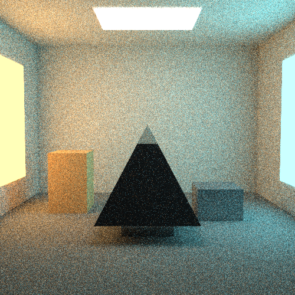

# Лабораторная работа 4

## Тема
Формирование изображения методом трассировки путей.

## Цель работы
Освоить простейшие методы синтеза изображений трехмерных сцен с учетом
глобального освещения методом трассировки путей. Убедиться в корректности
полученного изображения и показать влияние параметров Монте-Карло на шум и
время расчета.

## Задание
Необходимо построить изображение трехмерной сцены с учетом глобального
освещения методом трассировки путей.

В работе должны быть учтены следующие требования:

1. Геометрия сцены задается треугольной сеткой.
2. Используется цветовая модель RGB.
3. Материалы могут иметь диффузную и зеркальную составляющие.
4. Источники света должны быть протяженными.
5. Камера является точечной.
6. Антиалиасинг выполняется случайным выбором точки внутри пикселя.
7. Изображение формируется в вещественных яркостях, затем нормируется,
   гамма-корректируется и сохраняется в файл.
8. Программа должна позволять менять параметры сцены и рендера.

## Краткое описание результата
В работе реализован небольшой path tracer на Python. Программа строит изображение
сцены, состоящей из треугольников, с учетом прямого и непрямого освещения.

Основная демонстрационная сцена называется `triangle_disco`. Она представляет
собой темную комнату-дискотеку:

- в комнате находятся несколько цветных треугольных фигур;
- сверху расположен фасеточный зеркальный дискошар;
- четыре цветных протяженных источника света направлены на дискошар;
- пол имеет слабую зеркальную составляющую;
- изображение строится методом Монте-Карло.

Также в программе оставлены дополнительные сцены:

- `gallery` - световая галерея с зеркальной пирамидой;
- `cornell` - контрольная сцена типа Cornell box.

## Используемый метод

### Ray tracing и path tracing
В программе используется трассировка лучей, но не только в классическом смысле
"камера - объект - источник света". Реализован метод трассировки путей
(`path tracing`), где каждый луч может несколько раз отражаться от поверхностей.

Схема одного пути:

```text
камера -> первичный луч -> поверхность
       -> прямое освещение от источника
       -> случайное отражение
       -> следующая поверхность
       -> накопление яркости
```

Если луч попадает в светящуюся поверхность, ее излучение добавляется в итоговую
яркость. Если луч покидает сцену, дальнейший вклад считается нулевым.

### Метод Монте-Карло
Так как направления отражения и точки на источниках света выбираются случайно,
результат является оценкой методом Монте-Карло. Для одного пикселя выпускается
несколько лучей, затем их значения усредняются.

Если `N` - число лучей на пиксель, то шум уменьшается примерно как:

```text
noise ~ 1 / sqrt(N)
```

Поэтому при увеличении `samples per pixel` изображение становится чище, но время
расчета растет почти пропорционально.

## Геометрия сцены
Вся сцена состоит из треугольников. Прямоугольные поверхности создаются как два
треугольника, а более сложные объекты строятся из набора треугольников.

В программе используются следующие базовые сущности:

```text
Vec3      - трехмерный вектор или RGB-цвет;
Ray       - луч;
Triangle  - треугольник сцены;
Material  - материал поверхности;
Hit       - результат пересечения луча с поверхностью;
Scene     - сцена, список треугольников, источников света и BVH;
Camera    - точечная камера.
```

В сцене `triangle_disco` дискошар построен как фасеточная сфера из треугольников.
Для него используются `rings = 10` и `segments = 24`, поэтому шар выглядит
достаточно округлым, но все еще остается треугольной сеткой.

## Камера и антиалиасинг
Камера задается положением, точкой наблюдения, направлением вверх, углом обзора
и соотношением сторон изображения.

Для антиалиасинга луч проходит не через центр пикселя, а через случайную точку
внутри него:

```text
u = (x + random()) / width
v = (y + random()) / height
```

Из-за этого границы объектов при накоплении многих выборок становятся менее
ступенчатыми.

## Пересечение луча с треугольником
Для поиска пересечения используется алгоритм Моллера-Трумбора. Точка
пересечения ищется в виде:

```text
O + tD = A + u(B - A) + v(C - A)
```

где:

- `O` - начало луча;
- `D` - направление луча;
- `A`, `B`, `C` - вершины треугольника;
- `t` - расстояние вдоль луча;
- `u`, `v` - барицентрические координаты.

Пересечение считается корректным, если:

```text
t > 0
u >= 0
v >= 0
u + v <= 1
```

## Ускорение пересечений: BVH
Без ускорения каждый луч проверялся бы со всеми треугольниками сцены. Для сцены
с высокополигональным дискошаром это слишком медленно.

Для ускорения построена BVH-структура (`Bounding Volume Hierarchy`). Каждый узел
хранит осесмещенный ограничивающий параллелепипед `AABB`. Если луч не пересекает
параллелепипед узла, все треугольники внутри этого узла сразу отбрасываются.

Схема:

```text
луч -> AABB корневого узла
    -> AABB дочерних узлов
    -> треугольники только в подходящих листьях
```

Это существенно уменьшает количество проверок пересечений.

## Материалы
Материал поверхности имеет три компоненты:

```text
diffuse  - диффузное отражение;
mirror   - зеркальное отражение;
emission - собственное излучение.
```

Для физичности модели выполняется ограничение:

```text
diffuse[channel] + mirror[channel] <= 1
```

В программе это проверяется методом `validate()`.

Примеры материалов:

- стены имеют только диффузную составляющую;
- пол имеет диффузную и слабую зеркальную составляющую;
- дискошар имеет сильную зеркальную составляющую;
- лампы имеют ненулевую `emission`.

## Диффузное отражение
Диффузное отражение моделируется по Ламберту. BRDF равна:

```text
BRDF = diffuse / pi
```

Новое направление для диффузного отражения выбирается по косинусному
распределению относительно нормали поверхности. Такая выборка чаще выбирает
направления около нормали, что соответствует ламбертовской модели и снижает
дисперсию.

## Зеркальное отражение
Для зеркального события направление вычисляется по формуле:

```text
R = D - 2 * dot(D, N) * N
```

где:

- `D` - направление падающего луча;
- `N` - нормаль поверхности;
- `R` - направление отраженного луча.

Зеркальная составляющая используется для пола и дискошара.

## Русская рулетка
На каждом столкновении луча с поверхностью случайно выбирается событие:

- диффузное отражение;
- зеркальное отражение;
- поглощение.

Вероятность события зависит от коэффициентов материала. Чтобы оценка оставалась
несмещенной, вклад луча делится на вероятность выбранного события.

После нескольких отражений дополнительно используется русская рулетка для
завершения слабых путей.

## Прямое освещение
Для уменьшения шума отдельно оценивается прямое освещение:

```text
точка поверхности -> случайная точка на источнике света
```

В физической модели освещенность конкретной точки поверхности складывается из
вкладов всех источников света сцены. Вклад каждого источника зависит от его
мощности, площади, цвета, расстояния до точки и взаимной ориентации поверхности
и источника. Чем дальше источник, тем меньше его вклад из-за множителя
`1 / distance^2`.

Суммарно это можно записать как:

```text
L_direct(point) = sum(contribution_i(point)) по всем источникам i
```

В программе эта сумма считается методом Монте-Карло: на одной выборке выбирается
один протяженный источник и случайная точка на нем. Источники выбираются не
равновероятно, а с учетом мощности:

```text
weight = luminance(emission) * area
```

Поэтому более яркие и большие источники выбираются чаще. Деление на `pdf`
компенсирует случайный выбор, и при накоплении многих выборок получается оценка
той же суммы вкладов от всех источников.

Для выбранной точки источника учитываются:

- угол между нормалью поверхности и направлением на свет;
- угол между нормалью источника и направлением к поверхности;
- расстояние до источника;
- вероятность выбора источника и точки на нем;
- видимость источника из текущей точки.

Формула вклада:

```text
emission * BRDF * cos_surface * cos_light / (distance^2 * pdf)
```

Для теневых лучей используется быстрая проверка: достаточно найти любой объект
между точкой поверхности и источником. Ближайшее пересечение для этого искать не
нужно.

В программе есть параметр `light_samples`. Он задает, сколько выборок прямого
света брать на одно попадание луча в поверхность. Увеличение этого параметра
снижает шум от источников света, но увеличивает время расчета.

## Тайловый рендер и параллельность
Изображение разбивается на прямоугольные блоки - тайлы. Тайлы распределяются
между несколькими процессами.

Преимущества:

- лучше распределяется нагрузка между ядрами процессора;
- тяжелые области изображения не задерживают одну длинную полосу;
- live preview обновляется готовыми кусками изображения.

Размер тайла задается параметром:

```text
--tile-size
```

## Постобработка изображения
Path tracer считает цвет в вещественных RGB-яркостях. Перед сохранением
выполняются:

1. Умножение на экспозицию.
2. Ограничение значений диапазоном `0..1`.
3. Гамма-коррекция.
4. Перевод в `0..255`.
5. Запись в `PPM` и, при необходимости, в `PNG`.

Гамма-коррекция:

```text
V_corrected = V ^ (1 / gamma)
```

В работе используется `gamma = 2.2`.

## Программа
Основные файлы:

- [lab4.py](/Users/devianted/Desktop/Учёба/МТ:АКГ/MOI/lab4/lab4.py) - рендерер, path tracing, BVH, GUI и CLI;
- [scenes.py](/Users/devianted/Desktop/Учёба/МТ:АКГ/MOI/lab4/scenes.py) - описание сцен и геометрические вспомогательные функции;
- [Теория_ЛР4.md](/Users/devianted/Desktop/Учёба/МТ:АКГ/MOI/lab4/Теория_ЛР4.md) - дополнительное теоретическое описание.

Программа поддерживает два режима запуска:

```bash
python3 lab4.py
```

открывает графический интерфейс.

```bash
python3 lab4.py --cli ...
```

запускает рендер через параметры командной строки.

В GUI можно изменить:

- размер изображения;
- сцену;
- число лучей на пиксель;
- максимальную глубину пути;
- число выборок прямого света;
- число потоков;
- размер тайла;
- экспозицию;
- гамму;
- seed;
- путь сохранения файла.

## Параметры итогового рендера
Для итогового изображения использовались параметры:

```text
scene = triangle_disco
resolution = 500x500
samples per pixel = 30
max depth = 8
light samples = 4
workers = 9
tile size = 32
exposure = 0.55
gamma = 2.2
seed = 20260525
```

Время расчета составило примерно `400` секунд.

## Результат
Итоговое изображение сохранено в файлах:

- [lab4_render.ppm](/Users/devianted/Desktop/Учёба/МТ:АКГ/MOI/lab4/lab4_render.ppm);
- [lab4_render.png](/Users/devianted/Desktop/Учёба/МТ:АКГ/MOI/lab4/lab4_render.png).

Предпросмотр результата:



На изображении видны:

- цветное освещение от нескольких источников;
- тени от треугольных фигур;
- отражения на полу;
- фасеточный зеркальный дискошар;
- шум Монте-Карло, характерный для path tracing.

## Анализ результата
При малом числе лучей на пиксель изображение получается шумным. Это ожидаемо,
так как используется случайная оценка освещенности. При увеличении `samples per
pixel` шум уменьшается, но время расчета растет.

Дополнительно на шум влияет параметр `light_samples`. В сцене `triangle_disco`
используются несколько небольших цветных источников света, поэтому одна выборка
прямого света дает заметную дисперсию. Значение `light_samples = 4` делает тени
и освещение стабильнее.

После добавления BVH и тайлового рендера расчет стал значительно быстрее.
Оптимизация не меняет физическую модель освещения, а только ускоряет поиск
пересечений и распределение работы между процессами.

## Вывод
В лабораторной работе была реализована программа для формирования изображения
методом трассировки путей. Сцена задается треугольной сеткой, материалы имеют
диффузную и зеркальную составляющие, источники света являются протяженными.

В программе реализованы:

- генерация первичных лучей камерой;
- случайный выбор точки внутри пикселя для антиалиасинга;
- пересечение луча с треугольниками;
- диффузное отражение по модели Ламберта;
- зеркальное отражение;
- русская рулетка;
- выборка прямого света от протяженных источников;
- ускорение через BVH;
- параллельный тайловый рендер;
- гамма-коррекция и сохранение изображения.

Полученное изображение демонстрирует глобальное освещение, цветные источники,
тени, зеркальные отражения и характерный шум метода Монте-Карло.
